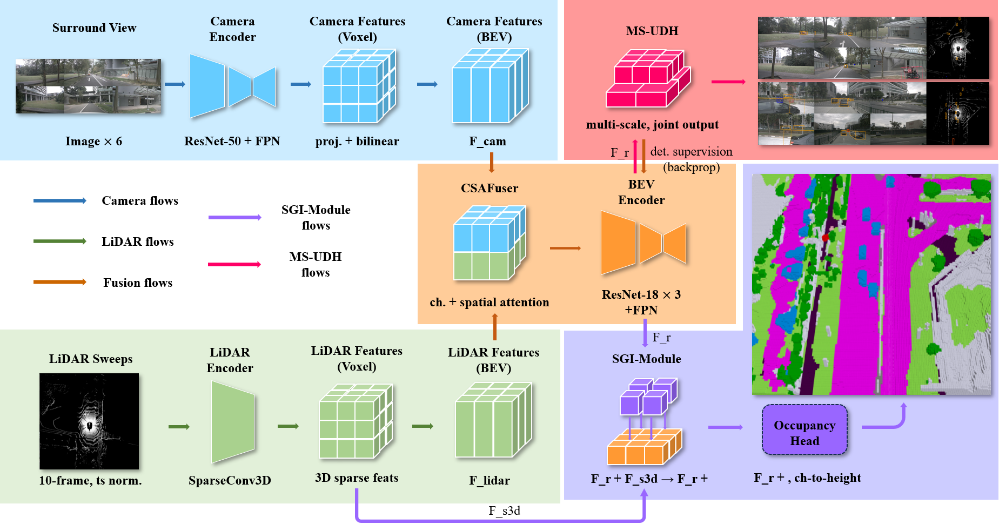

<div align="center">

# FuseOcc: Sparse Geometry Injection and Multi-Task Synergy for Occupancy Prediction


**Minghua Guo, Xiaofei Pei<sup>✉</sup>, Xing Wang**

School of Automotive Engineering, Wuhan University of Technology

</div>

---

## 📺 Demo

<div align="center">
  
  <p><em>FuseOcc simultaneously outputs 3D semantic occupancy and BEV object detection in a single model.</em></p>
</div>

## 📰 News

- **[2026-07]** 🚀 Code and models are coming soon!

## 📌 Introduction

**FuseOcc** is a multimodal end-to-end 3D semantic occupancy prediction network for autonomous driving, built upon three core designs:

- **CSAFuser** — Channel-Spatial Dual-Attention Fuser: independent SE channel attention within each modality, followed by Softmax-normalized cross-modal spatial weighting for per-location adaptive camera-LiDAR fusion.
- **SGI-Module** — Sparse Geometric Injection: intercepts 3D sparse features **before** LiDAR height compression and reinjects explicit vertical geometry into the decoded BEV features via a learnable height-wise convolution and a gated residual mechanism (~0.38M extra parameters).
- **MS-UDH** — Multi-Scale Unified Detection Head: multi-scale detection supervision with a high-resolution small-object branch, category-aware weighting, and IoU-aware regression loss; remains active at inference for single-model dual-task output.

## 🏗️ Architecture

<div align="center">
  
</div>

## 📊 Results

### Occupancy Prediction

| Benchmark | Backbone | Input | mIoU (%) |
|:---|:---:|:---:|:---:|
| Occ3D-nuScenes | ResNet-50 | 256×704 | **55.23** |
| nuScenes-Occupancy | ResNet-50 | 256×704 | **24.9** |
| CARLA (self-built) | ResNet-50 | 256×704 | **57.18** |

Auxiliary BEV detection on the nuScenes validation split: **0.6114 mAP / 0.6549 NDS**.

### Ablation of the Three Core Modules (Occ3D-nuScenes)


### Deployment

| Platform | Precision | FPS | mIoU (%) | mAP / NDS |
|:---|:---:|:---:|:---:|:---:|
| RTX 4090 | PyTorch FP32 | 7.1 | 55.23 | 0.6114 / 0.6549 |
| RTX 4090 | TensorRT FP16 | 89.3 | 54.21 | 0.6043 / 0.6513 |
| Jetson AGX Orin | TensorRT FP16+INT8 | 18.4 | 53.88 | 0.5912 / 0.6474 |

## 🛠️ Installation

```bash
conda create -n fuseocc python=3.8 -y
conda activate fuseocc

# PyTorch (adjust the CUDA version to your environment)
pip install torch==2.0.1 torchvision==0.15.2 --index-url https://download.pytorch.org/whl/cu118

# Dependencies (mmdet3d ecosystem)
pip install -r requirements.txt
```

Detailed instructions: [docs/install.md](docs/install.md)

## 📁 Data Preparation

Please follow [docs/dataset.md](docs/dataset.md) to prepare **Occ3D-nuScenes**, **nuScenes-Occupancy**, and the CARLA dataset.

```
data/
├── nuscenes/
│   ├── samples/
│   ├── sweeps/
│   └── gts/            # Occ3D annotations
└── carla/
```

## 🚀 Getting Started

**Training** (4 × RTX 4090):

```bash
bash tools/dist_train.sh configs/fuseocc/fuseocc_r50_256x704.yaml 4
```


**Evaluation:**

```bash
bash tools/dist_test.sh configs/fuseocc/fuseocc_r50_256x704.yaml ckpts/fuseocc.pth 4
```

**Visualization:**

```bash
python tools/visualize.py --config configs/fuseocc/fuseocc_r50_256x704.yaml --ckpt ckpts/fuseocc.pth
```

## 🎯 Model Zoo

| Config | Backbone | mIoU | Checkpoint |
|:---|:---:|:---:|:---:|
| fuseocc_r50_256x704 | ResNet-50 | 55.23 | Coming soon |

## 📖 Citation

If you find this work useful, please cite:

```bibtex
@article{guo2026fuseocc,
  title={FuseOcc: Sparse Geometry Injection and Multi-Task Synergy for Occupancy Prediction},
  author={Guo, Minghua and Pei, Xiaofei and Wang, Xing},
  year={2026}
}
```

## 🙏 Acknowledgements

This project is built upon [BEVFusion](https://github.com/mit-han-lab/bevfusion), [BEVDet](https://github.com/HuangJunJie2017/BEVDet), [FlashOcc](https://github.com/Yzichen/FlashOcc), [CenterPoint](https://github.com/tianweiy/CenterPoint), and [mmdetection3d](https://github.com/open-mmlab/mmdetection3d). Thanks for their excellent work!

## 📄 License

This project is released under the [Apache 2.0 License](LICENSE).
